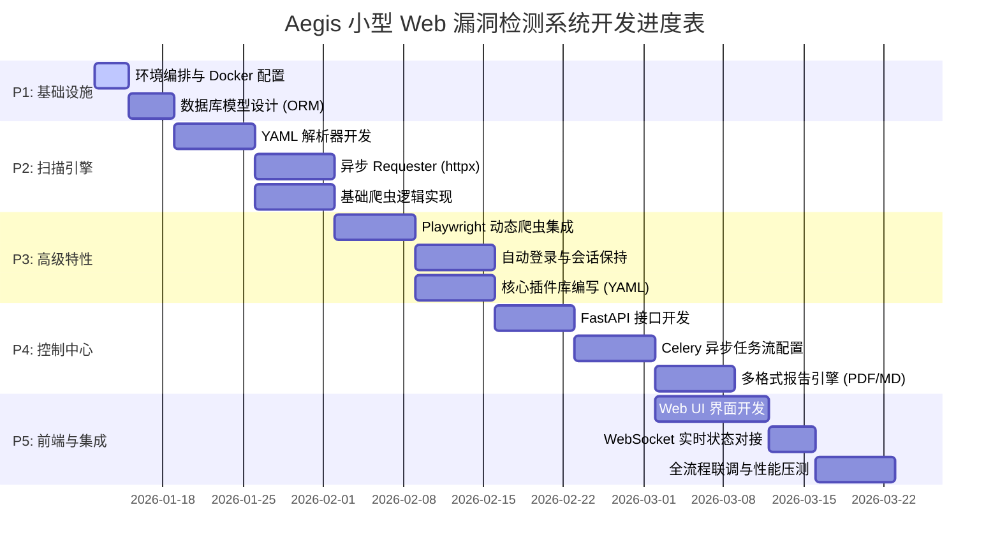

# Aegis 项目开发计划全案

## 1. 项目里程碑 (Milestones)

| 阶段 | 阶段名称 | 核心任务 | 预计周期 | 关键交付物 |
| :--- | :--- | :--- | :--- | :--- |
| **P1** | **基础设施搭建** | 初始化项目结构、配置 Docker Compose、建立数据库模型。 | 1 周 | 基础运行环境、数据库 Schema |
| **P2** | **核心扫描引擎** | 实现 YAML 解析器、异步 Requester、基础爬虫逻辑。 | 2 周 | YAML 引擎、基础扫描能力 |
| **P3** | **高级特性开发** | 集成 Playwright、实现自动登录逻辑、完善插件库。 | 2 周 | 自动登录功能、首批漏洞插件 |
| **P4** | **控制中心与报告** | 开发 FastAPI 接口、集成 Celery 任务流、实现 PDF/MD 导出。 | 2 周 | 完整后端 API、多格式报告 |
| **P5** | **前端与集成测试** | 构建 Web UI、对接 WebSocket 实时状态、进行全流程联调。 | 2 周 | 完整 Aegis 平台、测试报告 |

## 2. 详细任务分解

### P1: 基础设施 (Infrastructure)
- 环境编排：编写 `docker-compose.yml`，配置 MySQL、Redis。
- ORM 建模：定义 `ScanTask`、`Vulnerability` 和 `ReportTask` 模型。
- 配置管理：建立基于环境变量的配置系统。

### P2: 扫描引擎 (Scanning Engine)
- YAML 解析器：支持 Nuclei 风格的 `matchers` 和 `requests` 语法。
- 异步执行器：基于 `httpx` 实现并发请求与 QPS 限制。
- 基础爬虫：实现静态页面链接提取。

### P3: 高级特性 (Advanced Features)
- 动态爬虫：配置 Playwright 环境，支持 JS 渲染页面爬取。
- 自动登录：实现基于 Playwright 的会话提取与保持。
- 插件库：编写首批 20+ 个核心漏洞 YAML 模板。

### P4: 控制中心 (Control & Reporting)
- API 开发：实现任务创建、状态查询、漏洞列表接口。
- 异步任务流：配置 Celery Worker，实现扫描与报告任务解耦。
- 报告引擎：集成 WeasyPrint 实现异步 PDF 渲染。

### P5: 前端与集成 (Frontend & Integration)
- UI 开发：构建仪表盘、任务列表和漏洞详情页面。
- 实时通信：通过 WebSocket 实现扫描进度实时推送。
- 联调压测：全流程联调及单机环境性能优化。

## 3. 项目甘特图 (Gantt Chart)

## 4. 风险应对策略
- **资源占用**：严格限制 Celery Worker 并发数，管理 Playwright 实例生命周期。
- **反爬机制**：引入随机 User-Agent，支持自定义请求头。
- **渲染失败**：优先使用简单 CSS 布局，预留 HTML 预览作为备选。

---
*文档版本：v1.0*
*作者：Aegis 架构组*